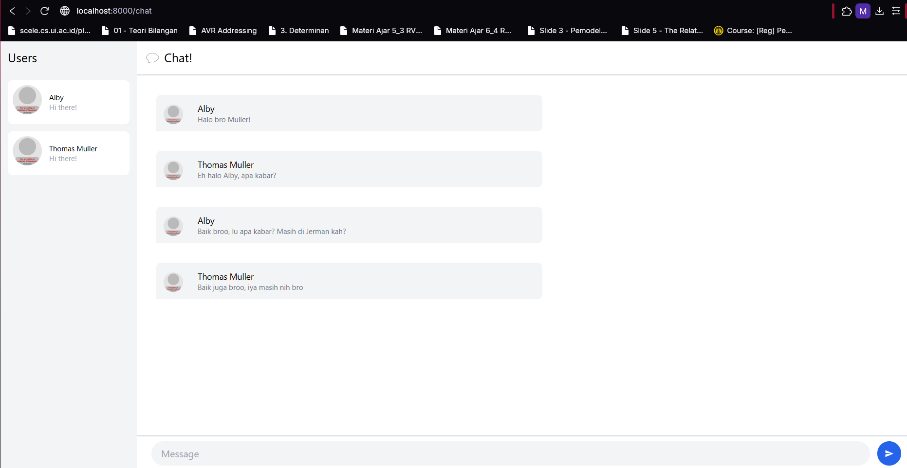

# Tutorial 10 Advance Programming
Muhammad Albyarto Ghazali (2306241695)

### 3.1. Original code

### 3.2. Add some creativities to the webclient

**Perubahan yang Ditambahkan :**  

**1. Animasi Background Gradient**  
Saya menambahkan efek animasi gradient pada background chat. Warna akan berubah secara perlahan dari ungu ke biru hingga pink. Animasi ini menggunakan CSS `@keyframes` dengan durasi 15 detik dan akan diulang terus menerus, sehingga memberikan kesan yang lebih hidup pada antarmuka.  

**2. Emoji Picker**  
Fitur ini memungkinkan pengguna untuk memilih emoji dengan mudah melalui panel pop-up. Terdapat 15 emoji yang bisa dipilih dengan sekali klik. Emoji akan otomatis dimasukkan ke dalam input pesan. Panel emoji muncul di atas input text ketika tombol emoji diklik.  

**3. Efek Hover dan Transisi**  
Semua elemen interaktif (tombol, daftar kontak, bubble chat) kini memiliki efek hover dan transisi yang halus. Contohnya:  
- Tombol mengubah warna saat dihover  
- Bubble chat memiliki shadow yang lebih tebal saat dihover  
- Transisi warna dan animasi diperhalus dengan `transition-colors duration-200`  

**4. Custom Scrollbar**  
Scrollbar di area chat didesain ulang agar lebih estetis dengan:  
- Warna ungu muda yang sesuai dengan tema  
- Lebar lebih tipis (8px)  
- Efek hover pada thumb scrollbar  

**5. Animasi Pesan Masuk**  
Pesan baru akan muncul dengan efek fade-in dan sedikit pergerakan dari bawah (`translateY`), memberikan feedback visual yang lebih menarik saat ada pesan masuk.  

**6. Perbaikan Tampilan UI**  
- **Sidebar Kontak**: Menambahkan hover effect dan spacing yang lebih baik  
- **Bubble Chat**: Shadow lebih soft dan padding lebih nyaman dibaca  
- **Input Area**: Tambahan tombol emoji dan peningkatan UX pada input text  

**7. Responsive Interaction**  
- Emoji picker akan otomatis tertutup saat:  
  - Emoji dipilih  
  - Pesan dikirim  
  - User klik di luar area picker  

**Cara Menggunakan Fitur Baru:**  
1. Klik tombol **😊** di sebelah input text untuk membuka emoji picker  
2. Pilih emoji yang diinginkan - akan otomatis masuk ke textbox  
3. Background akan berubah warna secara otomatis dengan efek gradient  
4. Arahkan kursor ke bubble chat atau kontak untuk melihat efek hover  

**Teknologi yang Digunakan:**  
- CSS Animations (`@keyframes`)  
- Custom Scrollbar (WebKit)  
- Yew Components untuk emoji picker  
- Transisi dengan Tailwind (`transition-*`)  
